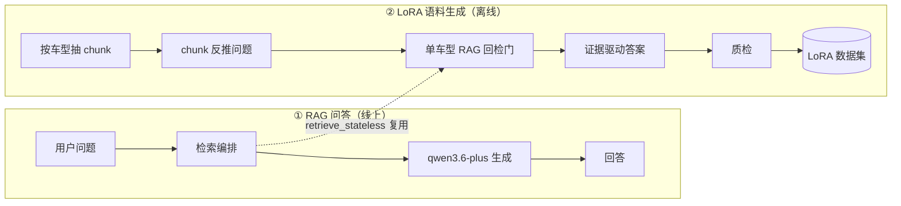
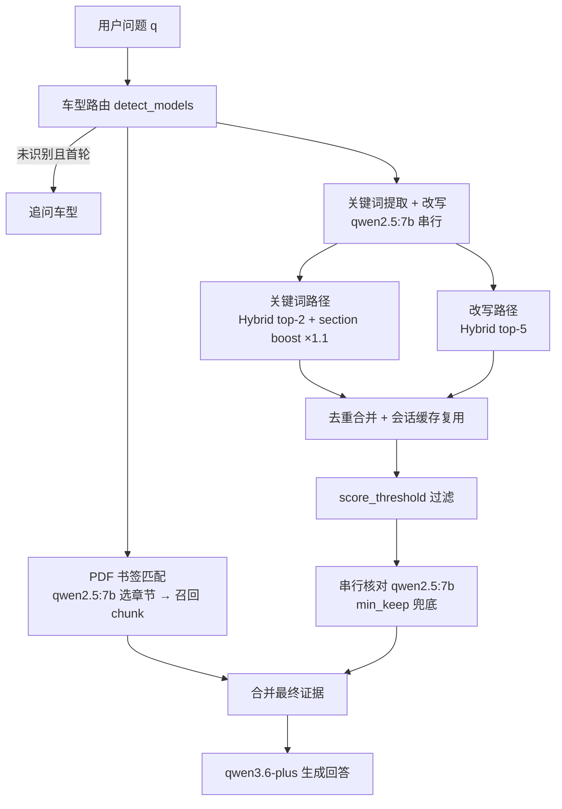
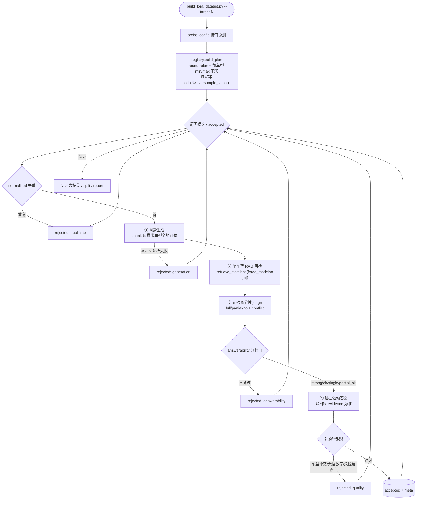

# LoRA 语料生成流水线 — 技术文档

> 适用分支：`feat/lora-corpus-pipeline`（原 `new`）
> 配套设计：[流水线设计](superpowers/specs/2026-06-23-lora-corpus-pipeline-design.md) · [数据来源说明](dataset_provenance.md) · [RAG 系统设计](design.md)

本分支在「车载手册 RAG 问答系统」之上，新增两块工作：

1. **MVP1.1 检索升级** —— 双路检索（关键词 + 改写）、PDF 书签匹配、串行核对、多车型支持。
2. **LoRA 语料生成流水线（`lora_gen/`）** —— 以手册 chunk 反推问题、单车型 RAG 回检、证据驱动答案、自动质检，产出可直接用于 LoRA 微调的 `instruction/input/output` 数据集。

第 2 块是本分支的主线工作（20 个提交），它**复用并依赖**第 1 块的检索能力做「回检门」。本文聚焦这两条工作流的运行方式、启动命令与环境配置。检索/索引/车型注册表的底层设计见 [design.md](design.md)，不在此重复。

---

## 1. 总览：两条工作流



- **工作流 ①** 是面向用户的在线问答（`python main.py chat`）。
- **工作流 ②** 是离线批量生成训练语料（`scripts/build_lora_dataset.py`），它把工作流 ① 的检索器当作「这道题用手册能不能答」的判定器。

---

## 2. 工作流 ①：RAG 检索问答

`main.py chat` → `Retriever.retrieve()` → `QwenClient.chat()`。检索编排（[retrieve/pipeline.py](../retrieve/pipeline.py)）为 MVP1.1 双路 + 书签 + 核对结构：



要点：

- **双路检索**：关键词路径偏 BM25 召回（`keyword_bm25_weight: 0.6`）并对命中 `section_path` 的 chunk 做 RRF 分数 boost；改写路径偏语义召回。两路用 RRF 融合后去重合并。
- **书签匹配**：用 PDF 目录书签 + `qwen2.5:7b` 选定最相关章节，直接召回该章节 chunk，作为高可信证据（[retrieve/bookmark_match.py](../retrieve/bookmark_match.py)）。
- **串行核对**：逐条让 `qwen2.5:7b` 判断 chunk 与问题是否相关，剔除噪声；`min_keep` 防误杀（[retrieve/verifier.py](../retrieve/verifier.py)）。
- **多车型**：`detect_models` 按别名识别问句车型，>1 车型时各车型分别取 top-k 再合并；识别不到且为首轮则追问。
- **所有 Ollama 调用串行，不并发**（设计约束）。

底层切分/嵌入/索引见 [design.md](design.md)。

---

## 3. 工作流 ②：LoRA 语料生成

入口 [scripts/build_lora_dataset.py](../scripts/build_lora_dataset.py)，编排 [lora_gen/pipeline.py](../lora_gen/pipeline.py)。**每条样本先绑定单一车型与 chunk 证据，再生成 `instruction/input/output`**，从根上规避车型混淆与事实幻觉。



### 3.1 五步管线

| 步骤 | 模块 | 职责 |
|------|------|------|
| Plan | [registry.py](../lora_gen/registry.py) · [chunks.py](../lora_gen/chunks.py) | 加载 corpus → 按 `min_chars`/`section_blacklist` 过滤 → 按车型 round-robin 抽样 `(model_id, chunk_id, task_type)`，受 `per_vehicle_min/max` 配额约束；`section_path → task_type` 映射 |
| ① 问题生成 | [prompts.py](../lora_gen/prompts.py) · [backends.py](../lora_gen/backends.py) | 以 chunk 为依据反推一条带车型名的用户问句；检索前做 normalized 精确去重省开销 |
| ② RAG 回检 | [pipeline.py](../lora_gen/pipeline.py) → `Retriever.retrieve_stateless` | 用问题在该车型内 hybrid 检索，得到回检证据与分数 |
| ③ 充分性 judge | [prompts.py](../lora_gen/prompts.py) | LLM 判断「问题+evidence」能否完整回答：`full/partial/no` + `conflict` |
| answerability 门 | [answerability.py](../lora_gen/answerability.py) | 综合 seed 命中/名次/分数、最高分、同章节数、judge 标签做分档裁决 |
| ④ 答案生成 | [prompts.py](../lora_gen/prompts.py) | **仅以回检 evidence 为准**生成 output（非凭模型记忆），贴近真实 RAG |
| ⑤ 质检 | [quality.py](../lora_gen/quality.py) | 穿帮语清洗 + 硬拒绝规则（见 3.3） |
| 导出 | [export.py](../lora_gen/export.py) | 写数据集、分层 train/dev split、rejected、generation report |

### 3.2 answerability 分档门

回检后按信号分档（阈值见 `config/dataset_gen.yaml`）：

| 档位 | 条件（简） | 入库 |
|------|-----------|------|
| `strong` | seed 在 top-3 ∧ max_score≥0.45 ∧ judge=full | ✅ |
| `ok` | seed 在 top-5 ∧ seed_score≥0.30 ∧ retrieved≥2 ∧ judge=full | ✅ |
| `single_chunk_full` | seed 命中 ∧ judge=full ∧ seed_score≥0.35（单 chunk 例外） | ✅ |
| `partial_ok` | seed 在 top-5 ∧ seed_score≥0.30 ∧ judge=partial | ⚠️ 仅配额内（默认 ≤8%） |
| reject | 其它 | ❌ |

拒绝原因枚举：`seed_not_returned / low_score / too_few_chunks / insufficient_evidence / partial_quota_full / evidence_conflict`。`partial_ok` 限配额，避免模型学成过度保守拒答。

### 3.3 质检硬门（最高价值）

| 规则 | 触发 |
|------|------|
| `vehicle_conflict` | input 或 output 命中 ≠ 绑定车型的车型（跨车型泄漏） |
| `ungrounded_number` | output 中规格数字未出现在 evidence |
| `unsafe_danger_advice` | 高压/电池/救援等主题给 DIY 建议却缺「联系授权服务中心」护栏 |
| `over_promise` | 含「免费/一定/永久/保证/100%」等且 evidence 无支撑 |
| `insurance_warranty_mix` / `field_incomplete` / `length_out_of_bounds` / `duplicate` | 断言不存在的保险质保条款 / 字段缺失 / 长度越界 / 近重复 |

`vehicle_conflict` 与 `ungrounded_number` 均为纯函数，便于 TDD。

### 3.4 断点续传

完整产出持久化到 `out_dir/accepted.jsonl` 与 `rejected.jsonl`。重跑时 `load_prior()` 回放重建 `result / done(qid) / partial 配额 / 去重集合`，已完成 qid 跳过，**不会覆盖丢失旧产出**。达到 `target_size` 或 `max_attempts` 即停。

---

## 4. 环境配置

### 4.1 依赖与虚拟环境

> ⚠️ 项目依赖装在 `week1/.venv`（**不是** conda）。lora_gen CLI 用绝对/相对 venv 解释器调用。

```bash
cd qa_rag_vehicle
python -m venv ../.venv          # 若尚未创建
../.venv/Scripts/activate        # Windows（bash: source ../.venv/Scripts/activate）
pip install -r requirements.txt
```

关键依赖（[requirements.txt](../requirements.txt)）：`langchain-community` / `faiss-cpu` / `sentence-transformers`（bge-large-zh 嵌入）/ `rank-bm25` / `pymupdf`（PDF + 书签）/ `openai`（DashScope 兼容模式）/ `ollama`。

### 4.2 API 密钥

```bash
cp .env.example .env
# 编辑 .env：
#   DASHSCOPE_API_KEY=<你的密钥>
#   DASHSCOPE_BASE_URL=https://dashscope.aliyuncs.com/compatible-mode/v1
```

`.env` 已被 `.gitignore`，切勿提交。

### 4.3 本地 LLM（Ollama）

改写、书签匹配、核对、本地 judge 均用 `qwen2.5:7b`：

```bash
ollama pull qwen2.5:7b
ollama serve          # 或 ollama run qwen2.5:7b
```

后端选择由 `config/dataset_gen.yaml` 控制：`backend: cloud`（问答生成用 `qwen3.6-plus`）、`judge_backend: local`（充分性判定用 `qwen2.5:7b`，省成本）。

### 4.4 语料索引

流水线读取合并索引 `indexes/hierarchy/corpus/`（5201 chunk，覆盖 18 车型）。若缺失，先建库：

```bash
python main.py build              # 默认 hierarchy 策略
python main.py info               # 查看建库状态
```

> 仓库提供 `indexes.tar`，可解包代替重新建库：`tar -xf indexes.tar`。

---

## 5. 启动方式

### 5.1 工作流 ①：问答

```bash
python main.py build              # PDF → FAISS + BM25 索引（首次）
python main.py chat               # 多轮终端问答
python main.py info               # 配置 / 建库状态
```

对话内命令：`/quit` 退出 · `/clear` 清空会话 · `/log` 上轮检索详情 · `/models` 车型列表 · `/config` 配置摘要。

### 5.2 工作流 ②：生成 LoRA 语料

```bash
# 0) 运行前自检：corpus / detect_models / Retriever / QwenClient / Ollama 是否就绪
../.venv/Scripts/python.exe scripts/check_interfaces.py

# 1) 生成（pilot 默认 100 条）
../.venv/Scripts/python.exe scripts/build_lora_dataset.py --target 100 --out data/lora_out

# 可选参数
#   --target N                目标 accepted 条数（覆盖 dataset_gen.yaml）
#   --out DIR                 产物目录（默认 data/lora_out）
#   --manual-check-ratio 0.1  人工抽检比例（写入 report）
```

[check_interfaces.py](../scripts/check_interfaces.py) 在跑批前确认五项接口连通，输出 `RESULT: OK/FAIL`，避免跑到一半才发现密钥/Ollama 不通。

> 数据来源与人工抽检流程见 [dataset_provenance.md](dataset_provenance.md)。

### 5.3 产物（`--out` 目录）

| 文件 | 说明 |
|------|------|
| `ito_lora_dataset.json` | 最终数据集，严格 `[{instruction, input, output}]` |
| `ito_lora_dataset.train.json` / `.dev.json` | 按 task_type 分层的 9:1 split |
| `ito_lora_dataset.meta.jsonl` | 每条 accepted 的完整溯源中间字段 |
| `ito_lora_dataset_rejected.json` | 被拒样本 + 阶段/原因（诊断瓶颈） |
| `generation_report.md` | 按拒绝原因 / task_type / 车型统计 |
| `accepted.jsonl` / `rejected.jsonl` | 断点续传账本（回放重建用） |

---

## 6. 配置参考 `config/dataset_gen.yaml`

```yaml
target_size: 100            # 目标 accepted 条数
oversample_factor: 2.5      # 候选量 = ceil(target × factor)，抵消回检/质检拒绝
max_attempts: 400           # 处理候选硬上限，防死循环
backend: cloud              # 问答生成：cloud=qwen3.6-plus | local=qwen2.5:7b
judge_backend: local        # 充分性 judge 后端
vehicle_subset: []          # 空=全部 18 车型；pilot 可填子集
per_vehicle_min: 3          # 每车型最少/最多采样
per_vehicle_max: 10
answerability: { topk, seed_score_min, strong_*, partial_ok_quota: 0.08, ... }
chunks: { min_chars: 200, section_blacklist: [前言, 目录, ...] }
quality: { max_output_chars: { 直接问答: 400, 步骤指导: 800, ... } }
export: { train_dev_split: 0.9 }
```

完整键见文件本体与[设计文档 §8](superpowers/specs/2026-06-23-lora-corpus-pipeline-design.md)。

---

## 7. 测试

`lora_gen/` 各模块以 TDD 编写，LLM 调用打桩，共 **51 个单测 / 11 个文件**全过：

```bash
../.venv/Scripts/python.exe -m pytest tests/lora_gen -q
```

覆盖：`registry`（采样配额/round-robin）、`chunks`（过滤/黑名单/task 映射）、`answerability`（分档/配额/conflict 拒绝）、`quality`（车型冲突/无据数字/危险护栏）、`export`（split 比例/report 结构）、`schema`（序列化往返）等。LLM 集成走小样本冒烟，不进 CI 断言。

---

## 8. 模块速查

| 模块 | 职责 |
|------|------|
| [lora_gen/registry.py](../lora_gen/registry.py) | 采样计划：round-robin + per-vehicle 配额 |
| [lora_gen/chunks.py](../lora_gen/chunks.py) | corpus 加载、可用性过滤、section→task_type |
| [lora_gen/prompts.py](../lora_gen/prompts.py) | 各阶段 prompt + instruction 模板池 |
| [lora_gen/backends.py](../lora_gen/backends.py) | cloud/local LLM 抽象 + 鲁棒 JSON 抽取 |
| [lora_gen/answerability.py](../lora_gen/answerability.py) | 回检分档门 |
| [lora_gen/quality.py](../lora_gen/quality.py) | 质检拒绝规则 |
| [lora_gen/schema.py](../lora_gen/schema.py) | Sample/SampleMeta/Rejected 数据结构 |
| [lora_gen/pipeline.py](../lora_gen/pipeline.py) | 编排 + 断点续传 |
| [lora_gen/export.py](../lora_gen/export.py) | 数据集/split/report 导出 |
| [lora_gen/dgconfig.py](../lora_gen/dgconfig.py) · [compat.py](../lora_gen/compat.py) | 配置加载 / 接口探测兼容层 |
| [scripts/build_lora_dataset.py](../scripts/build_lora_dataset.py) | CLI 入口 |
| [scripts/check_interfaces.py](../scripts/check_interfaces.py) | 跑批前自检 |
</content>
</invoke>
